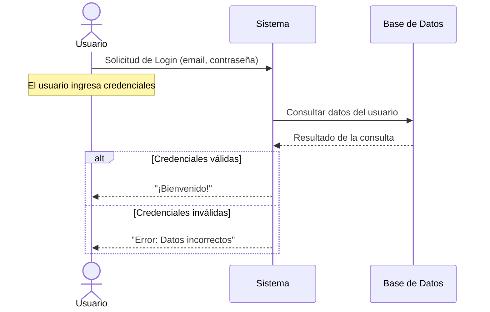

```mermaid
sequenceDiagram
    actor Usuario as Usuario
    participant Sistema as Sistema
    participant BaseDeDatos as Base de Datos

    Usuario->>Sistema: Solicitud de Login (email, contraseña)
    Note over Usuario: El usuario ingresa credenciales
    Sistema->>BaseDeDatos: Consultar datos del usuario
    BaseDeDatos-->>Sistema: Resultado de la consulta
    alt Credenciales válidas
        Sistema-->>Usuario: "¡Bienvenido!"
    else Credenciales inválidas
        Sistema-->>Usuario: "Error: Datos incorrectos"
    end
```