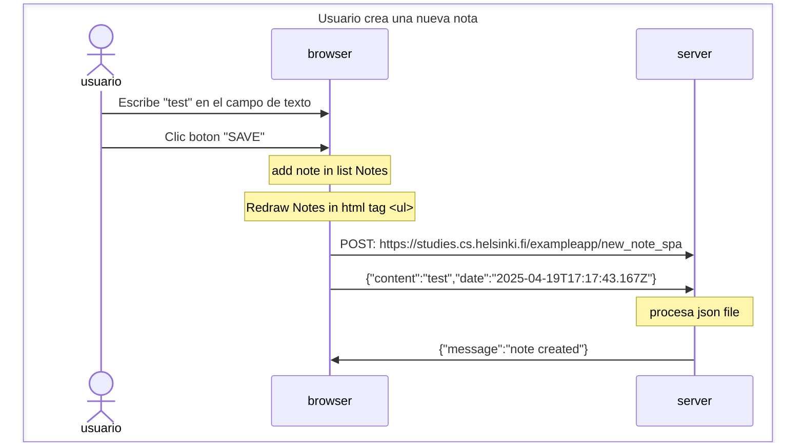

```mermaid
sequenceDiagram
box Usuario crea una nueva nota
    actor usuario as usuario
    participant browser as browser
    participant server as server
end
usuario->>browser: Escribe "test" en el campo de texto
usuario->>browser: Clic boton "SAVE"
Note over browser: add note in list Notes
Note over browser: Redraw Notes in html tag <ul>

browser->>server: POST: https://studies.cs.helsinki.fi/exampleapp/new_note_spa
browser->>server: {"content":"test","date":"2025-04-19T17:17:43.167Z"}
Note over server: procesa json file
server->>browser: {"message":"note created"}


```