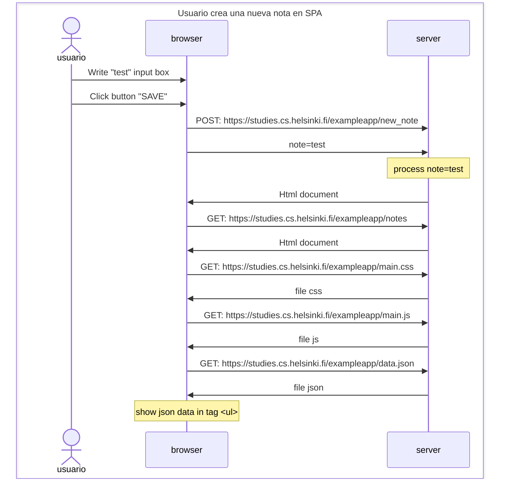

```mermaid
sequenceDiagram
box Usuario crea una nueva nota en SPA
    actor usuario as usuario
    participant browser as browser
    participant server as server
end
usuario->>browser: Write "test" input box
usuario->>browser: Click button "SAVE"

browser->>server: POST: https://studies.cs.helsinki.fi/exampleapp/new_note

browser->>server: note=test

note over server: process note=test
server->>browser: Html document

browser->>server: GET: https://studies.cs.helsinki.fi/exampleapp/notes
server->>browser: Html document

browser->>server: GET: https://studies.cs.helsinki.fi/exampleapp/main.css
server->>browser: file css

browser->>server: GET: https://studies.cs.helsinki.fi/exampleapp/main.js
server->>browser: file js

browser->>server: GET: https://studies.cs.helsinki.fi/exampleapp/data.json
server->>browser: file json


Note over browser: show json data in tag <ul>


```